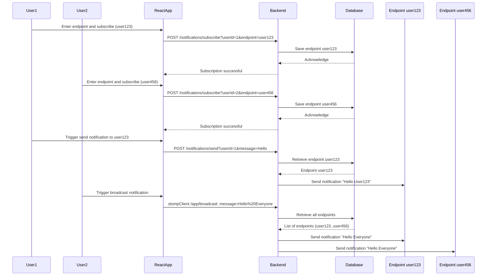

## The flow

```mermaid
sequenceDiagram
    participant User1
    participant User2
    participant ReactApp
    participant Backend
    participant Database

    User1->>ReactApp: Enter endpoint and subscribe (user123)
    ReactApp->>Backend: POST /notifications/subscribe?userId=1&endpoint=user123
    Backend->>Database: Save endpoint user123
    Database-->>Backend: Acknowledge
    Backend-->>ReactApp: Subscription successful

    User2->>ReactApp: Enter endpoint and subscribe (user456)
    ReactApp->>Backend: POST /notifications/subscribe?userId=2&endpoint=user456
    Backend->>Database: Save endpoint user456
    Database-->>Backend: Acknowledge
    Backend-->>ReactApp: Subscription successful

    User1->>ReactApp: Trigger send notification to user123
    ReactApp->>Backend: POST /notifications/send?userId=1&message=Hello
    Backend->>Database: Retrieve endpoint user123
    Database-->>Backend: Endpoint user123
    Backend->>Endpoint user123: Send notification "Hello User123"

    User2->>ReactApp: Trigger broadcast notification
    ReactApp->>Backend: stompClient /app/broadcast: message=Hello%20Everyone
    Backend->>Database: Retrieve all endpoints
    Database-->>Backend: List of endpoints (user123, user456)
    Backend->>Endpoint user123: Send notification "Hello Everyone"
    Backend->>Endpoint user456: Send notification "Hello Everyone"
```
## Run
```
mvn spring-boot:run
```

## Test
```
http://localhost:8080
```
